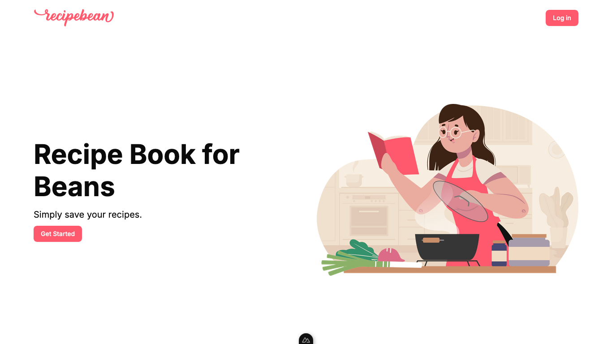
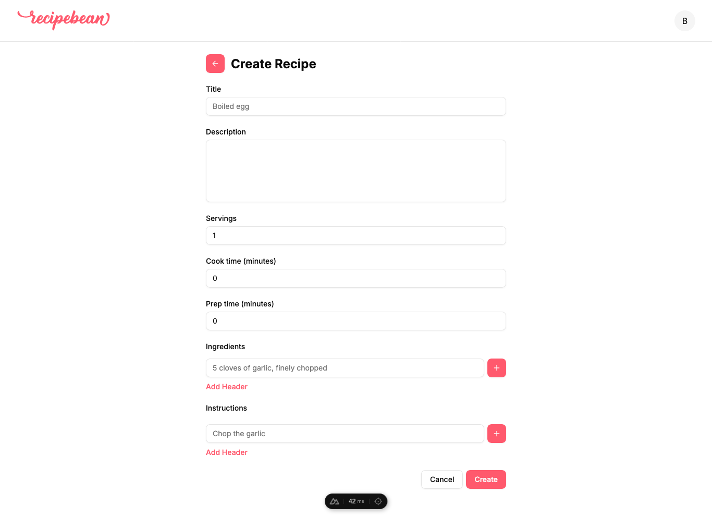
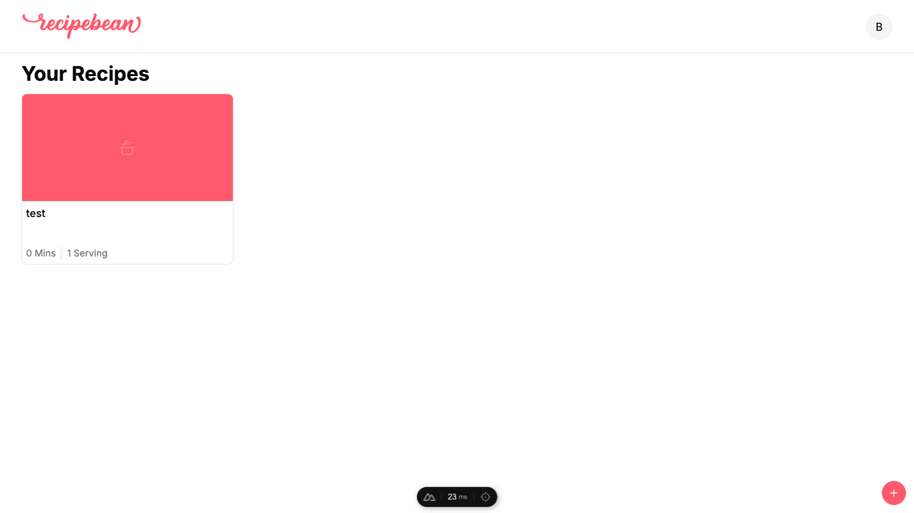
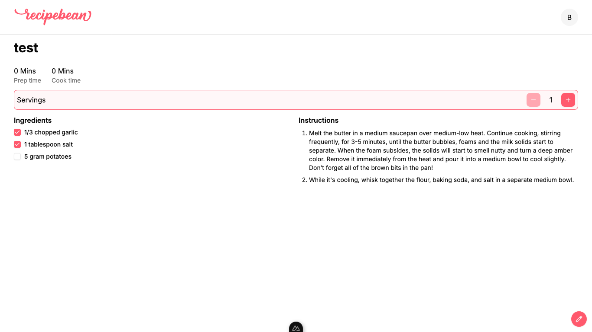

<!-- Improved compatibility of back to top link: See: https://github.com/othneildrew/Best-README-Template/pull/73 -->
<a id="readme-top"></a>
<!--
*** Thanks for checking out the Best-README-Template. If you have a suggestion
*** that would make this better, please fork the repo and create a pull request
*** or simply open an issue with the tag "enhancement".
*** Don't forget to give the project a star!
*** Thanks again! Now go create something AMAZING! :D
-->

<!-- PROJECT SHIELDS -->
<!--
*** I'm using markdown "reference style" links for readability.
*** Reference links are enclosed in brackets [ ] instead of parentheses ( ).
*** See the bottom of this document for the declaration of the reference variables
*** for contributors-url, forks-url, etc. This is an optional, concise syntax you may use.
*** https://www.markdownguide.org/basic-syntax/#reference-style-links
-->

<!-- PROJECT LOGO -->
<br />
<div align="center">
  <a href="https://github.com/othneildrew/Best-README-Template">
    
  </a>

  <h3 align="center">Recipebean</h3>

  <p align="center">
    My girlfriend made me do this 😦
    <!-- <br />
    <a href="https://github.com/othneildrew/Best-README-Template"><strong>Explore the docs »</strong></a>
    <br />
    <br />
    <a href="https://github.com/othneildrew/Best-README-Template">View Demo</a>
    &middot;
    <a href="https://github.com/othneildrew/Best-README-Template/issues/new?labels=bug&template=bug-report---.md">Report Bug</a>
    &middot;
    <a href="https://github.com/othneildrew/Best-README-Template/issues/new?labels=enhancement&template=feature-request---.md">Request Feature</a> -->
  </p>
</div>

<!-- TABLE OF CONTENTS -->
<details>
  <summary>Table of Contents</summary>
  <ol>
    <li>
      <a href="#about-the-project">About The Project</a>
      <ul>
        <li><a href="#built-with">Built With</a></li>
      </ul>
    </li>
    <li>
      <a href="#getting-started">Getting Started</a>
      <ul>
        <li><a href="#prerequisites">Prerequisites</a></li>
        <li><a href="#installation">Installation</a></li>
      </ul>
    </li>
    <li><a href="#usage">Usage</a></li>
    <li><a href="#acknowledgments">Acknowledgments</a></li>
  </ol>
</details>

<!-- ABOUT THE PROJECT -->
## About The Project
<p align="center">
  
</p>

My girlfriend needed a cookbook app so she can easily save and organize her recipes.

You can:
* save recipes
* adjust serving sizes

<p align="right">(<a href="#readme-top">back to top</a>)</p>

### Built With

* [![Nuxt][Nuxt]][Nuxt-url]
* [![TailwindCSS][TailwindCSS]][TailwindCSS-url]
* [![ShadcnUI][ShadcnUI]][ShadcnUI-url]
* [![PostgreSQL][PostgreSQL]][PostgreSQL-url]
* [![Drizzle][Drizzle]][Drizzle-url]

<p align="right">(<a href="#readme-top">back to top</a>)</p>

<!-- GETTING STARTED -->
## Getting Started

If you want to run this locally, here are the steps.

### Prerequisites

* Create a Google OAuth consent screen on GCP to get the client ID and secret key
* Install pnpm
* Install PostgreSQL (example with docker image)
  ```sh
  docker run --name postgres-17.5 -p 5432:5432 -e POSTGRES_PASSWORD=password -d postgres:17.5
  ```

### Installation

_Below is an example of how you can instruct your audience on installing and setting up your app. This template doesn't rely on any external dependencies or services._

1. Clone the repo
   ```sh
   git clone https://github.com/RandumbWilliam/recipebean.git
   ```
2. Install NPM packages
   ```sh
   pnpm install
   ```
3. Create `.env` following `.env.example`

4. Run dev mode
   ```sh
   pnpm dev
   ```

<p align="right">(<a href="#readme-top">back to top</a>)</p>

<!-- USAGE EXAMPLES -->
## Usage

Create recipe
<p align="center">
  
</p>

Your recipes
<p align="center">
  
</p>

Viewing a recipe
<p align="center">
  
</p>

<p align="right">(<a href="#readme-top">back to top</a>)</p>

<!-- ACKNOWLEDGMENTS -->
## Acknowledgments

My girlfriend

<p align="right">(<a href="#readme-top">back to top</a>)</p>

<!-- MARKDOWN LINKS & IMAGES -->
<!-- https://www.markdownguide.org/basic-syntax/#reference-style-links -->
[contributors-shield]: https://img.shields.io/github/contributors/othneildrew/Best-README-Template.svg?style=for-the-badge
[contributors-url]: https://github.com/othneildrew/Best-README-Template/graphs/contributors
[forks-shield]: https://img.shields.io/github/forks/othneildrew/Best-README-Template.svg?style=for-the-badge
[forks-url]: https://github.com/othneildrew/Best-README-Template/network/members
[stars-shield]: https://img.shields.io/github/stars/othneildrew/Best-README-Template.svg?style=for-the-badge
[stars-url]: https://github.com/othneildrew/Best-README-Template/stargazers
[issues-shield]: https://img.shields.io/github/issues/othneildrew/Best-README-Template.svg?style=for-the-badge
[issues-url]: https://github.com/othneildrew/Best-README-Template/issues
[license-shield]: https://img.shields.io/github/license/othneildrew/Best-README-Template.svg?style=for-the-badge
[license-url]: https://github.com/othneildrew/Best-README-Template/blob/master/LICENSE.txt
[linkedin-shield]: https://img.shields.io/badge/-LinkedIn-black.svg?style=for-the-badge&logo=linkedin&colorB=555
[linkedin-url]: https://linkedin.com/in/othneildrew
[product-screenshot]: images/screenshot.png

[Nuxt]: https://img.shields.io/badge/nuxt-020420?style=for-the-badge&logo=nuxt&logoColor=00DC82
[Nuxt-url]: https://nuxt.com/
[TailwindCSS]: https://img.shields.io/badge/tailwind%20css-030721?style=for-the-badge&logo=tailwindcss&logoColor=06B6D4
[TailwindCSS-url]: https://tailwindcss.com/
[ShadcnUI]: https://img.shields.io/badge/shadcn%2Fvue-000000?style=for-the-badge&logo=shadcnui&logoColor=41b883
[ShadcnUI-url]: https://www.shadcn-vue.com/
[PostgreSQL]: https://img.shields.io/badge/PostgreSQL-4169E1?style=for-the-badge&logo=postgresql&logoColor=white
[PostgreSQL-url]: https://www.postgresql.org/
[Drizzle]: https://img.shields.io/badge/Drizzle%20ORM-121212?style=for-the-badge&logo=drizzle&logoColor=C5F74F
[Drizzle-url]: https://orm.drizzle.team/
