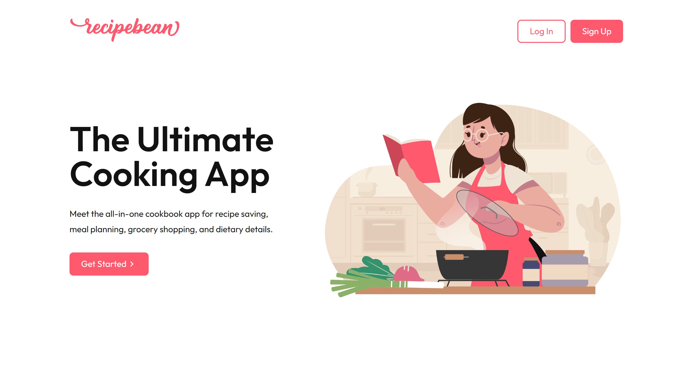

<!-- Improved compatibility of back to top link: See: https://github.com/othneildrew/Best-README-Template/pull/73 -->

<a name="readme-top"></a>

<!-- PROJECT LOGO -->
<br />
<div align="center">
  <a href="https://github.com/RandumbWilliam/recipebean">
    
</a>

<h3 align="center">Recipebean</h3>

  <p align="center">
    Modernized cooking app
    <br />
    <br />
    <a href="https://randumb-recipebean.netlify.app/">View Demo</a>
  </p>
</div>

<!-- TABLE OF CONTENTS -->
<details>
  <summary>Table of Contents</summary>
  <ol>
    <li>
      <a href="#about-the-project">About The Project</a>
      <ul>
        <li><a href="#built-with">Built With</a></li>
      </ul>
    </li>
    <li>
      <a href="#getting-started">Getting Started</a>
      <ul>
        <li><a href="#prerequisites">Prerequisites</a></li>
        <li><a href="#installation">Installation</a></li>
      </ul>
    </li>
    <li><a href="#usage">Usage</a></li>
    <li><a href="#roadmap">Roadmap</a></li>
    <li><a href="#contributing">Contributing</a></li>
    <li><a href="#license">License</a></li>
    <li><a href="#contact">Contact</a></li>
    <li><a href="#acknowledgments">Acknowledgments</a></li>
  </ol>
</details>

<!-- ABOUT THE PROJECT -->

## About The Project

  <a href="https://randumb-recipebean.netlify.app/" target="_blank">
    
</a>
<br />
<br />

Having a passion for cooking, I wanted a personalized digtial cookbook to store my recipes. There are many great apps out there, but are either over-saturated with features and stray away from a personalized cookbook, or have clunky UI that are not intuitive to the user. The goal of this project was to create a simple and intuitive UI cookbook app to store you recipes.

<p align="right">(<a href="#readme-top">back to top</a>)</p>

### Built With

- [![Next][Next.js]][Next-url]
- [![TypeScript][TypeScript]][TypeScript-url]
- [![MUI][MUI]][MUI-url]
- [![StyledComponents][Styled-Components]][Styled-Components-url]
- [![Node][Node.js]][Node-url]
- [![Express][Express]][Express-url]
- [![GraphQL][GraphQL]][GraphQL-url]
- [![Apollo-GraphQL][Apollo-Graphql]][Apollo-GraphQL-url]
- [![MikroORM][MikroORM]][MikroORM-url]
- [![TypeGraphQL][TypeGraphQL]][TypeGraphQL-url]
- [![PostgreSQL][PostgreSQL]][PostgreSQL-url]
- [![Redis][Redis]][Redis-url]
- [![Cloudinary][Cloudinary]][Cloudinary-url]
- [![Render][Render]][Render-url]

<p align="right">(<a href="#readme-top">back to top</a>)</p>

<!-- GETTING STARTED -->

## Getting Started

This is an example of how setup the project locally:

### Prerequisites

- **npm**

  ```sh
  npm install npm@latest -g
  ```

- **Cloudinary** - setup a cloudinary account to get necessary information to store recipe cover images:

  ```
  CLOUDINARY_CLOUD_NAME =
  CLOUDINARY_FOLDER =
  CLOUDINARY_API_KEY =
  CLOUNDINARY_API_SECRET =
  ```

- **Redis** - setup redis to store sessions (default redis URL)

  ```
  REDIS_URL = 127.0.0.1:6379
  ```

- **PostgreSQL** - setup local PostreSQL for your database
  ```
  POSTGRES_USER =
  POSTGRES_PASSWORD =
  POSTGRES_DB_NAME =
  POSTGRES_HOST =
  POSTGRES_PORT =
  ```

### Installation

1. Clone the repo

   ```sh
   git clone https://github.com/RandumbWilliam/recipebean.git
   ```

2. Grap the necessary environment variables from Cloundinary and PostgreSQL
3. Create a `.env` and fill in the necessary environment variables provided by `.env.example` for both `client` and `server`
4. Run your redis server
   ```sh
   redis-server
   ```
5. `server` - install NPM packages
   ```sh
   npm install
   ```
6. `server` - run watch
   ```sh
   npm run watch
   ```
7. `server` - run dev
   ```sh
   npm run dev
   ```
8. `client` - install NPM packages
   ```sh
   npm install
   ```
9. `client` - run dev
   ```sh
   npm run dev
   ```

<p align="right">(<a href="#readme-top">back to top</a>)</p>

<!-- ROADMAP -->

## Roadmap

- [ ] Add Ingredient Shopping List
- [ ] Add Meal Planner
- [ ] Add Additional UI tweaks

<p align="right">(<a href="#readme-top">back to top</a>)</p>

<!-- LICENSE -->

## License

Distributed under the MIT License. See `LICENSE.txt` for more information.

<p align="right">(<a href="#readme-top">back to top</a>)</p>

<!-- CONTACT -->

## Contact

William Zhen - https://www.linkedin.com/in/william-zhen/ - w2zhen@uwaterloo.ca

Project Link: [https://github.com/RandumbWilliam/recipebean](https://github.com/RandumbWilliam/recipebean)

<p align="right">(<a href="#readme-top">back to top</a>)</p>

<!-- MARKDOWN LINKS & IMAGES -->
<!-- https://www.markdownguide.org/basic-syntax/#reference-style-links -->

[contributors-shield]: https://img.shields.io/github/contributors/github_username/repo_name.svg?style=for-the-badge
[contributors-url]: https://github.com/github_username/repo_name/graphs/contributors
[forks-shield]: https://img.shields.io/github/forks/github_username/repo_name.svg?style=for-the-badge
[forks-url]: https://github.com/github_username/repo_name/network/members
[stars-shield]: https://img.shields.io/github/stars/github_username/repo_name.svg?style=for-the-badge
[stars-url]: https://github.com/github_username/repo_name/stargazers
[issues-shield]: https://img.shields.io/github/issues/github_username/repo_name.svg?style=for-the-badge
[issues-url]: https://github.com/github_username/repo_name/issues
[license-shield]: https://img.shields.io/github/license/github_username/repo_name.svg?style=for-the-badge
[license-url]: https://github.com/github_username/repo_name/blob/master/LICENSE.txt
[linkedin-shield]: https://img.shields.io/badge/-LinkedIn-black.svg?style=for-the-badge&logo=linkedin&colorB=555
[linkedin-url]: https://linkedin.com/in/linkedin_username
[product-screenshot]: images/home_screenshot.png
[Next.js]: https://img.shields.io/badge/next.js-000000?style=for-the-badge&logo=nextdotjs&logoColor=white
[Next-url]: https://nextjs.org/
[Apollo-GraphQL]: https://img.shields.io/badge/-ApolloGraphQL-311C87?style=for-the-badge&logo=apollo-graphql
[Apollo-GraphQL-url]: https://www.apollographql.com/
[TypeScript]: https://img.shields.io/badge/typescript-%23007ACC.svg?style=for-the-badge&logo=typescript&logoColor=white
[TypeScript-url]: https://www.typescriptlang.org/
[GraphQL]: https://img.shields.io/badge/-GraphQL-E10098?style=for-the-badge&logo=graphql
[GraphQL-url]: https://graphql.org/
[MUI]: https://img.shields.io/badge/-MUI-007FFF?style=for-the-badge&logo=mui&logoColor=white
[MUI-url]: https://mui.com/
[Styled-Components]: https://img.shields.io/badge/-StyledComponents-DB7093?style=for-the-badge&logo=styledcomponents&logoColor=white
[Styled-Components-url]: https://styled-components.com/
[Node.js]: https://img.shields.io/badge/-Node.js-339933?style=for-the-badge&logo=nodedotjs&logoColor=white
[Node-url]: https://nodejs.org/en
[Express]: https://img.shields.io/badge/-Express-000000?style=for-the-badge&logo=express
[Express-url]: https://expressjs.com/
[MikroORM]: https://img.shields.io/badge/-MikroORM-006384?style=for-the-badge&logo=
[MikroORM-url]: https://mikro-orm.io/
[TypeGraphQL]: https://img.shields.io/badge/-TypeGraphQL-E10098?style=for-the-badge&logo=
[TypeGraphQL-url]: https://typegraphql.com/
[PostgreSQL]: https://img.shields.io/badge/-PostgreSQL-4169E1?style=for-the-badge&logo=postgresql&logoColor=white
[PostgreSQL-url]: https://www.postgresql.org/
[Redis]: https://img.shields.io/badge/-Redis-DC382D?style=for-the-badge&logo=redis&logoColor=white
[Redis-url]: https://redis.io/
[Cloudinary]: https://img.shields.io/badge/-Cloudinary-3448C5?style=for-the-badge&logo=
[Cloudinary-url]: https://cloudinary.com/
[Render]: https://img.shields.io/badge/-Render-46E3B7?style=for-the-badge&logo=render&logoColor=white
[Render-url]: https://render.com/
